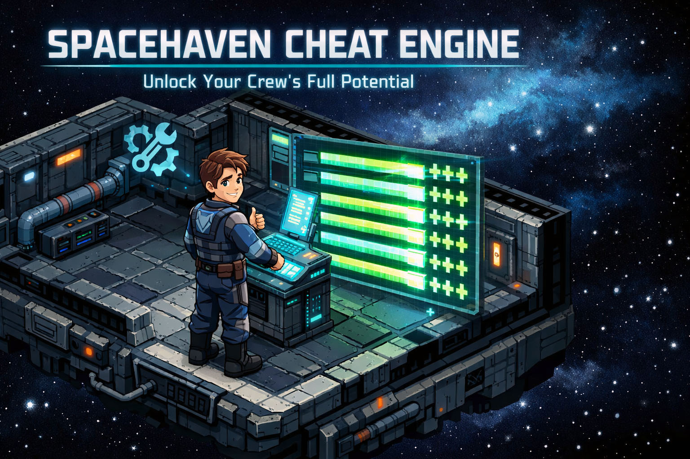

# spacehaven-cheat-engine

<p align="center">
  
</p>

[](https://pypi.org/project/spacehaven-cheat-engine/)
[](https://www.python.org/downloads/)
[](https://www.gnu.org/licenses/gpl-3.0.html)
[](https://djdarcy.github.io/spacehaven-cheat-engine/stats/#installs)
[](https://github.com/djdarcy/spacehaven-cheat-engine/discussions)
[](docs/platform-support.md)

Remove all skill and attribute point caps from [Space Haven](https://store.steampowered.com/app/979110/Space_Haven/) character creation. Build your dream crew using the game's own editor UI without artificial limits.

## What It Does

Space Haven's character creation screen enforces strict point budgets: ~12 for attributes, ~63 for skill potential, ~32 for starting skills. If you import a custom crew XML or just want more control, you'll hit "Too many skill points allocated."

**spacehaven-cheat-engine** patches the game's Java bytecode to:
- Remove the "too many points" error completely
- Unlock the + buttons for attributes and skills
- Show 127 free points in every allocation pool
- Raise the total skill level ceiling from 10 to 127

The game's built-in UI handles everything else. Just click + and - to build exactly the character you want.

## Installation

```bash
pip install spacehaven-cheat-engine
```

Or run directly from source:

```bash
git clone https://github.com/djdarcy/spacehaven-cheat-engine.git
cd spacehaven-cheat-engine
python -m spacehaven_cheat_engine
```

## Usage

**Close Space Haven before patching.** The patcher needs write access to `spacehaven.jar`.

### Recommended Workflow

```bash
spacehaven-cheat --enable         # 1. Enable patches (game must be closed)
                                  # 2. Launch game, create your characters
                                  # 3. Close game when done
spacehaven-cheat --disable        # 4. Restore original game files
```

**It's recommended that you disable the patches after character creation.** This keeps your game files clean for GoG / Steam updates and avoids any potential conflicts with the game or distribution platform. Don't worry, your created characters keep their stats. The patches only affect the character creation screen.

### All Commands

```bash
spacehaven-cheat                  # Toggle: enable if off, disable if on
spacehaven-cheat --enable         # Apply patches
spacehaven-cheat --disable        # Restore original game files
spacehaven-cheat --status         # Check current state
spacehaven-cheat --path "D:\..."  # Specify game path (if auto-detect fails)
```

The patcher auto-detects common Steam installation paths. Use `--path` if your game is installed elsewhere.

### Example

```
$ spacehaven-cheat --enable
 ___                  _  _                     ___ _             _
/ __|_ __ ___  __ __ | || | ___ _  _ __  __   / __| |_  ___ ___ | |_
\__ \ '_ / o \/ _/ _)| -- |/ o \ \/ / _)|  \ | (__| ' \/ -_/ o \|  _|
|___/ .__\__,_\__\__,|_||_|\__,_\__/\__,|_|_| \___|_||_\___\__,_|\__|
    |_|              Unlock Your Crew's Full Potential

  Game: E:\SteamLibrary\steamapps\common\SpaceHaven

  Applying patches...

  Backup saved: spacehaven.jar.cheatengine-backup
  patched: maxTotalSkillLevel (bipush)
  patched: checkTooManyPoints() -> no-op
  patched: canAddPointToAttribute() -> always true
  patched: canAddPointToSkill() -> always true
  patched: getFreeAttributePoints() -> 127
  patched: getFreeStartSkillPoints() -> 127
  patched: getFreeBaseSkillPoints() -> 127
  config.json: added verification bypass flags

  Cheat mode enabled! Point caps removed.
  Launch the game and create your dream crew.
```

## How It Works

Space Haven is a Java game. The patcher:

1. **Parses Java class constant pools** to find validation methods by name (not hardcoded byte offsets)
2. **Patches 7 locations** across 2 class files in `spacehaven.jar`
3. **Adds JVM flags** (`-noverify`, `-Xverify:none`) to `config.json` so the modified bytecode passes verification
4. **Creates backups** of both files on first run, restores cleanly on `--disable`

### What Gets Patched

| Location | Original | Patched |
|----------|----------|---------|
| `maxTotalSkillLevel` | 10 | 127 |
| `checkTooManyPoints()` | Validation logic | `return;` (no-op) |
| `canAddPointToAttribute()` | Budget check | `return true;` |
| `canAddPointToSkill()` | Budget check | `return true;` |
| `getFreeAttributePoints()` | Budget calculation | `return 127;` |
| `getFreeStartSkillPoints()` | Budget calculation | `return 127;` |
| `getFreeBaseSkillPoints()` | Budget calculation | `return 127;` |

### Surviving Game Updates

Because patches are found by **method name** (parsed from the Java constant pool), not hardcoded byte offsets, the patcher should survive most game updates. If a patch target can't be found, it reports which methods are missing.

After a Steam update: just run `spacehaven-cheat --enable` again.

## FAQ

**Will this corrupt my save files?**
No. The patcher only modifies `spacehaven.jar` (game code) and `config.json` (JVM settings). Save files are untouched.

**Can I go back to normal?**
Yes. `spacehaven-cheat --disable` restores the original files from backup. You can also use Steam's "Verify Integrity of Game Files" to re-download the originals.

**Does this work with the latest version?**
The patcher was built against the current RC3 Steam release. Pattern-based patching means it should work with future updates unless the game's character creation code is fundamentally rewritten.

**Can I set skills above 5?**
Yes. With the patches applied, the game's UI lets you push attributes and skills beyond their normal maximums.

## Requirements

- **Python 3.10+**
- **Space Haven** (Steam version)
- **Game must be closed** before patching

No additional dependencies -- pure Python stdlib.

## Development

```bash
git clone https://github.com/djdarcy/spacehaven-cheat-engine.git
cd spacehaven-cheat-engine
pip install -e ".[dev]"
pytest
```

## Contributing

Contributions welcome! See [CONTRIBUTING.md](CONTRIBUTING.md) for guidelines.

Like the project?

[](https://www.buymeacoffee.com/djdarcy)

## License

spacehaven-cheat-engine, Copyright (C) 2026 Dustin Darcy.

This project is licensed under the GNU General Public License v3.0 -- see [LICENSE](LICENSE) for full details.
